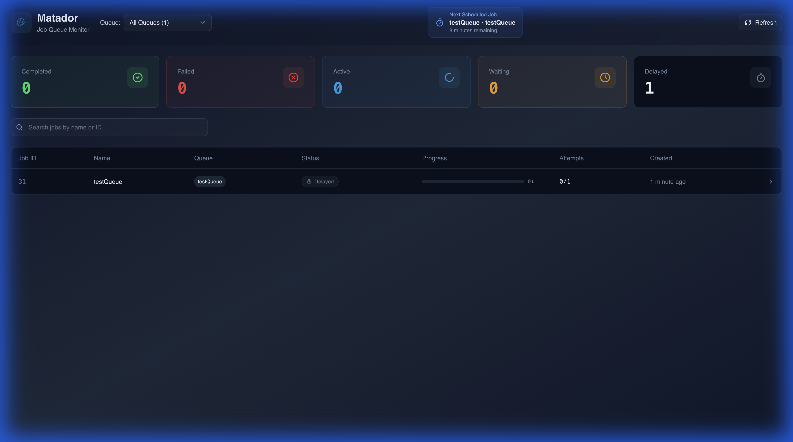
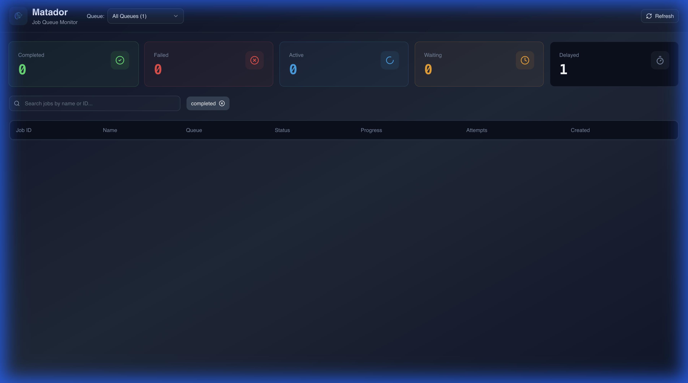
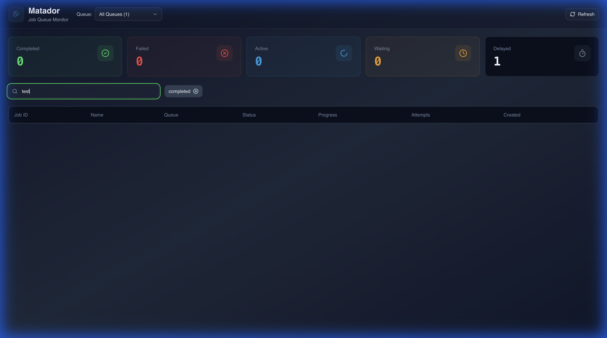

# 🎯 Matador

<p align="center">
  
</p>

<h3 align="center">Modern Job Queue Monitoring Dashboard</h3>

<p align="center">
  A high-performance dashboard for monitoring and managing BullMQ job queues. Built with React, TypeScript, and optimized for speed with <strong>99% faster API response times</strong> through parallel Redis operations.
</p>

<p align="center">
  
</p>

## ✨ Features

- **📊 Real-time Queue Monitoring** - View all your job queues at a glance
- **🎯 Job Filtering** - Filter jobs by status (Completed, Failed, Active, Waiting, Delayed)
- **⏰ Next Scheduled Job** - See upcoming scheduled jobs with live countdown
- **⚡ Blazing Fast** - Optimized with parallel Redis calls (~238ms API response time)
- **🎨 Modern UI** - Clean, responsive interface built with shadcn/ui
- **🔍 Search & Filter** - Quickly find jobs by queue, status, or job ID
- **📈 Statistics** - View aggregated stats across all queues
- **🐳 Docker Ready** - Easy deployment with Docker and Docker Compose
- **🔌 BullMQ Compatible** - Works seamlessly with BullMQ job queues

### 📸 Screenshots

<details>
<summary><b>Filter Jobs by Status</b></summary>
<br>

</details>

<details>
<summary><b>Search Functionality</b></summary>
<br>

</details>

## 🏗️ Architecture


### Technology Stack

**Frontend:**
- React 18 + TypeScript
- Vite for fast builds
- shadcn/ui components
- TanStack Query for state management
- Tailwind CSS for styling

**Backend:**
- Node.js + Express
- TypeScript
- BullMQ for queue management
- Redis (ioredis)

### Service Architecture

The backend follows a modular service architecture with specialized services:

- **`BullMQService` (Facade)** - Main orchestrator, provides clean API
- **`RedisConnectionService`** - Manages Redis connections and BullQueue instances
- **`QueueDiscoveryService`** - Auto-discovers queues with caching (5s TTL)
- **`JobFetchingService`** - Fetches jobs with parallel Redis calls
- **`StatsService`** - Calculates aggregate statistics

## 🚀 Quick Start

### Prerequisites

- Node.js 18+
- Redis server running
- npm or yarn

### Installation

```bash
# Clone the repository
git clone https://github.com/yourusername/matador.git
cd matador

# Install dependencies
npm install

# Install server dependencies
cd server && npm install && cd ..
```

### Development

```bash
# Start Redis (if not already running)
docker run -d -p 6379:6379 redis:latest

# Terminal 1: Start the backend server
cd server
npm run dev

# Terminal 2: Start the frontend dev server
npm run dev
```

Open [http://localhost:5173](http://localhost:5173) in your browser.

### Production Build

```bash
# Build both frontend and backend
npm run build:all

# Start the production server
cd server
npm start
```

The app will be available at [http://localhost:3000](http://localhost:3000).

## 🐳 Docker Deployment

### Using Docker Compose (Recommended)

The easiest way to run the entire stack:

```bash
# Start both Redis and Matador
docker-compose up --build

# Stop the services
docker-compose down
```

### Using Docker Only

```bash
# Build the image
npm run docker:build

# Run the container (requires external Redis)
docker run -p 3000:3000 \
  -e REDIS_HOST=host.docker.internal \
  -e REDIS_PORT=6379 \
  matador
```

See [README-DOCKER.md](README-DOCKER.md) for detailed Docker deployment instructions.

## ⚙️ Configuration

### Environment Variables

Create a `.env` file in the `server` directory:

```env
# Redis Configuration
REDIS_HOST=localhost
REDIS_PORT=6379
REDIS_PASSWORD=

# Server Configuration
PORT=3000
NODE_ENV=production
```

### Redis Configuration

For optimal performance, configure Redis with the `noeviction` policy:

```bash
# In redis.conf
maxmemory-policy noeviction
```

Or via command line:
```bash
redis-cli CONFIG SET maxmemory-policy noeviction
```

## 📖 Usage

### Connecting to Your Queues

Matador automatically discovers all BullMQ queues in your Redis instance. Just ensure:

1. Your BullMQ queues are using the same Redis instance
2. Matador backend can connect to that Redis instance
3. Queue names follow the BullMQ naming convention (`bull:queueName:*`)

### API Endpoints

The backend exposes the following REST API endpoints:

- **GET** `/api/queues` - List all discovered queues
- **GET** `/api/jobs` - Get jobs (supports filtering by queue and status)
- **GET** `/api/stats` - Get aggregate statistics
- **GET** `/api/health` - Health check endpoint

Example:
```bash
# Get all jobs from a specific queue
curl "http://localhost:3000/api/jobs?queue=my-queue"

# Get only failed jobs
curl "http://localhost:3000/api/jobs?status=failed"

# Get jobs from a specific queue with a status filter
curl "http://localhost:3000/api/jobs?queue=my-queue&status=active"
```

## 🎯 Performance Optimizations

Matador is built for speed:

### Before Optimization
- `/api/jobs`: ~25,000ms (25 seconds!)
- `/api/queues`: ~10,000ms
- `/api/stats`: ~27,000ms

### After Optimization
- `/api/jobs`: **~238ms** ⚡ (99% improvement)
- `/api/queues`: **~115ms** ⚡ (98% improvement)
- `/api/stats`: **~238ms** ⚡ (99% improvement)

**How we achieved this:**
1. **Parallel Redis Calls** - Fetch jobs from all queues and statuses concurrently
2. **Smart Caching** - 5-second cache for queue discovery
3. **Reduced Payload** - Limit jobs to 30 per status (configurable)
4. **Service Modularization** - Optimized code organization

## 🛠️ Development

### Project Structure

```
matador/
├── src/                      # Frontend source
│   ├── components/           # React components
│   ├── services/             # API client
│   ├── hooks/                # Custom React hooks
│   └── lib/                  # Utilities
├── server/                   # Backend source
│   ├── src/
│   │   ├── services/         # Backend services
│   │   │   ├── bullmq.service.ts
│   │   │   ├── redis-connection.service.ts
│   │   │   ├── queue-discovery.service.ts
│   │   │   ├── job-fetching.service.ts
│   │   │   └── stats.service.ts
│   │   ├── routes/           # API routes
│   │   └── index.ts          # Server entry point
│   └── dist/                 # Compiled backend
├── docs/                     # Documentation and images
├── Dockerfile                # Production Docker image
├── docker-compose.yml        # Docker Compose configuration
└── README.md                 # This file
```

### Running Tests

```bash
# Frontend tests
npm test

# Backend tests
cd server
npm test
```

## 🤝 Contributing

Contributions are welcome! Please feel free to submit a Pull Request.

1. Fork the repository
2. Create your feature branch (`git checkout -b feature/amazing-feature`)
3. Commit your changes (`git commit -m 'Add some amazing feature'`)
4. Push to the branch (`git push origin feature/amazing-feature`)
5. Open a Pull Request

### Development Guidelines

- Follow the existing code style
- Write tests for new features
- Update documentation as needed
- Ensure all tests pass before submitting PR

## 📝 License

This project is licensed under the MIT License - see the [LICENSE](LICENSE) file for details.

## 🙏 Acknowledgments

- [BullMQ](https://bullmq.io/) - The fantastic job queue library
- [shadcn/ui](https://ui.shadcn.com/) - Beautiful UI components
- [Redis](https://redis.io/) - The blazing fast in-memory database

## 📧 Support

If you encounter any issues or have questions:

- 🐛 [Report a bug](https://github.com/yourusername/matador/issues)
- 💡 [Request a feature](https://github.com/yourusername/matador/issues)
- 📖 [Read the documentation](https://github.com/yourusername/matador/wiki)

---

**Made with ❤️ for the developer community**
